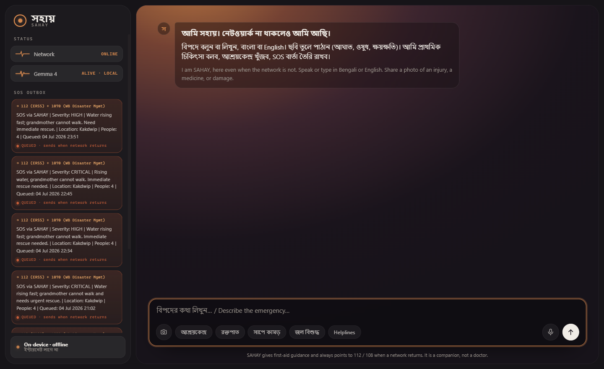
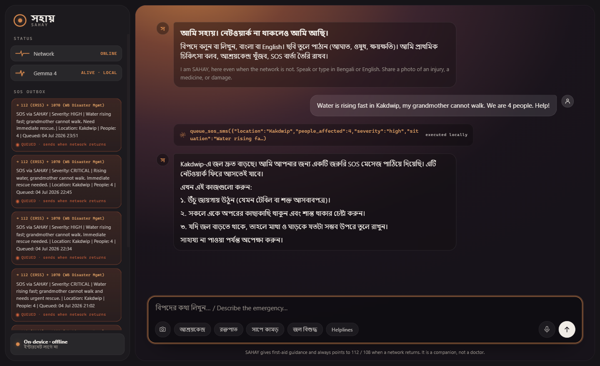

# সহায় SAHAY: the offline disaster companion

**When the network dies, help shouldn't.**

SAHAY is an offline-first, multimodal disaster-response companion for cyclone- and
flood-affected West Bengal, built on **Google DeepMind's Gemma 4 (E4B)** running fully
locally via Ollama. No internet, no cloud, no API key: the model, the knowledge, and
the tools all live on the device.

Built in 24 hours for the **Build with Gemma: Kolkata** hackathon (Kaggle) by
**Team TeesMaarKhaCoders**: Chandan Saha, Aritra Giri, Subhojyoti Maity.
Track: **GenAI for Good**.

## Why offline is the whole point

When Cyclone Amphan hit Kolkata in May 2020, power and mobile networks were down for
days across South Bengal. The moment people need information the most, first aid,
where the shelters are, how to make water safe, is exactly the moment the internet
disappears. Every cloud chatbot fails this test by design.

Gemma 4's edge models change that: frontier-quality reasoning, **Bengali among 140+
languages**, **native audio and vision**, and **native function calling**, in a model
that runs on a mid-range laptop GPU (RTX 3050, 6 GB), or a phone.



*A live turn with the network off: a plea for rescue comes in, Gemma 4 decides on its
own to call `queue_sos_sms` (severity high, 4 people), answers in calm Bengali, and the
SOS OUTBOX queues the message to send the instant any network returns.*



## What it does

| You do | SAHAY does |
|---|---|
| Speak in Bengali: *"প্রচুর রক্ত পড়ছে, কী করব?"* | Understands the speech, retrieves the verified bleeding-control protocol, answers step by step in Bengali |
| Share a photo of a wound, flooded room, or medicine strip | Gemma 4 vision assesses it: severity triage, damage description, or reads the medicine label aloud in plain Bengali |
| *"I'm trapped near Kakdwip, water is rising"* | Calls `queue_sos_sms` → a structured SOS is queued in the outbox and transmits the instant any network returns |
| *"Where is the nearest shelter?"* | Calls `find_nearest_shelter` → searches the offline West Bengal shelter registry |
| *"বাবা safe আছে"* | Calls `log_family_member` → offline family check-in board for reunification |

## Architecture

```
 ┌────────────── laptop / edge device (no internet) ──────────────┐
 │                                                                │
 │  Browser UI ── voice (MediaRecorder) · camera · Bengali chat   │
 │      │                                                         │
 │  FastAPI backend (app/server.py)                               │
 │      │── BM25 RAG over knowledge/ (bilingual first-aid,        │
 │      │   preparedness, shelters, retrieved per message)       │
 │      │── native function-calling loop:                         │
 │      │     queue_sos_sms · find_nearest_shelter ·              │
 │      │     first_aid_lookup · log_family_member · get_helplines│
 │      ▼                                                         │
 │  Ollama ── Gemma 4 E4B (text + vision + audio, 128K ctx)       │
 └────────────────────────────────────────────────────────────────┘
```

Gemma 4 is the single brain: it understands Bengali speech and photos, decides when
to call tools, grounds its answers in retrieved protocol chunks, and speaks the
user's language back.

## Run it

```bash
# 1. Ollama + model (one-time, ~10 GB)
ollama pull gemma4:e4b

# 2. Backend + UI
pip install -r requirements.txt
uvicorn app.server:app --port 8000

# 3. Open http://localhost:8000 in your browser, then turn your Wi-Fi off.
```

Optional voice fallback if your Ollama build doesn't accept audio yet:
`pip install faster-whisper` (local STT, still fully offline).

## Repository layout

```
app/        FastAPI server, RAG, function-calling tools
web/        offline-first UI (no CDN assets, system Bengali fonts)
knowledge/  bilingual first-aid + preparedness corpus, shelter & helpline registries
notebook/   clonable Kaggle notebook demo (transformers + native audio)
```

## Why this stands apart

Mapped to the hackathon's judging rubric (Gemma Integration, Innovation and Impact,
Functionality, Presentation):

- **Gemma is necessary, not decorative.** The problem requires a model that runs on the
  device. In a cyclone there is no cloud, so a cloud API is disqualified by the problem
  itself. SAHAY leans on the capabilities only an open on-device model like Gemma 4 has:
  Bengali speech in, a photo in, grounded first aid out, and a real tool call, one model
  doing all four.
- **A problem the community has lived.** Amphan (2020), Yaas (2021) and Remal (2024) each
  took power and networks off South Bengal for days. The moment people needed information
  the most was the exact moment the internet was gone. Local, high-stakes, and real.
- **It acts, it does not just chat.** Native function calling turns words into action:
  a queued SOS, an offline shelter lookup, a family reunification board. The demo shows
  the network dead and the model still working, something a cloud app cannot do.
- **Built honestly.** We hit a real bug (Gemma 4 image input is broken in the current
  Ollama build) and handled it in the open: vision routes to Gemma-4-12B, and the Kaggle
  notebook shows E4B doing native vision and audio via `transformers`. We would rather
  ship something true than fake a demo.

## Honesty notes

- The shelter registry is an illustrative sample; production would load the official
  WBSDMA/NDMA shelter database (same schema).
- SAHAY gives standard first-aid guidance (IFRC/WHO-style) and always directs users
  to professional care (112/108) the moment networks return. It is a companion, not
  a doctor.
